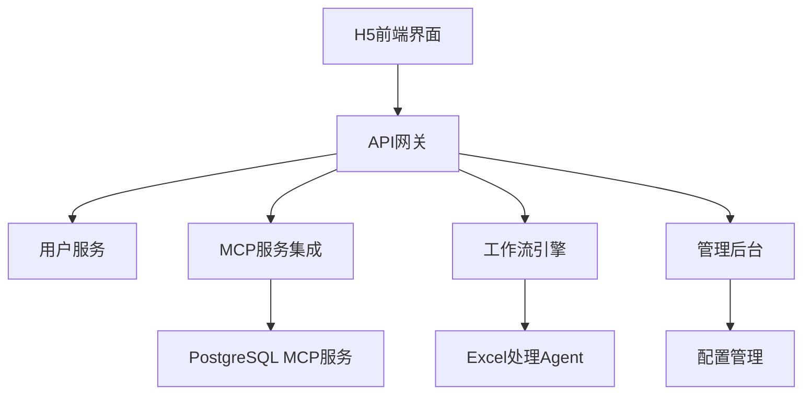

# Design Document

## Overview

AI聊天助手是一个类客服形态的聊天机器人系统，集成MCP服务兼容第三方接口，支持基于PostgreSQL的MCP服务生成用户反馈报表，结合Excel处理Agent构建工作流，并提供管理后台配置MCP及工作流。系统采用前后端分离架构，前端使用Vue3 + TypeScript，后端使用Go + Kratos框架。

## Steering Document Alignment

### Technical Standards (tech.md)
- 遵循前后端分离架构模式
- 采用RESTful API设计规范
- 使用PostgreSQL作为主要数据存储
- 集成MCP服务标准接口

### Project Structure (structure.md)
- 前端代码位于`frontend/`目录
- 后端代码位于`backend/`目录
- 微服务组件位于`micro/`目录
- 配置文件统一管理

## Code Reuse Analysis

### Existing Components to Leverage
- **PostgreSQL连接池**: 复用现有数据库连接管理
- **Kratos框架中间件**: 复用认证、日志、错误处理中间件
- **React组件库**: 复用现有的UI组件和样式

### Integration Points
- **MCP服务接口**: 通过标准MCP协议集成第三方服务
- **PostgreSQL数据库**: 连接现有用户反馈数据表
- **Excel处理服务**: 集成报表导出功能

## Architecture

### Modular Design Principles
- **单一职责原则**: 每个模块专注于特定功能域
- **组件隔离**: 创建小型、专注的组件而非大型单体文件
- **服务层分离**: 分离数据访问、业务逻辑和展示层
- **工具模块化**: 将工具拆分为专注的单一用途模块



## Components and Interfaces

### H5前端组件
- **Purpose:** 提供类客服形态的聊天界面
- **Interfaces:** Vue3组件、WebSocket连接、API调用
- **Dependencies:** Vue3, TypeScript, WebSocket客户端
- **Reuses:** 现有UI组件库、样式系统

### API网关组件
- **Purpose:** 统一处理前端请求路由和认证
- **Interfaces:** RESTful API、JWT认证、请求验证
- **Dependencies:** Kratos框架、JWT中间件、数据库连接
- **Reuses:** 现有认证中间件、日志系统

### MCP服务集成组件
- **Purpose:** 集成第三方MCP服务，生成用户反馈报表
- **Interfaces:** MCP协议接口、PostgreSQL查询、报表生成
- **Dependencies:** PostgreSQL驱动、MCP客户端库
- **Reuses:** 数据库连接池、查询构建器

### 工作流执行引擎
- **Purpose:** 执行多步骤工作流（数据库查询 → Excel导出）
- **Interfaces:** 工作流定义API、任务调度、Excel导出
- **Dependencies:** 任务队列、Excel处理库
- **Reuses:** 数据库连接、文件处理工具

### 管理后台组件
- **Purpose:** 配置MCP服务和工作流
- **Interfaces:** 管理界面、配置API、监控面板
- **Dependencies:** 前端管理框架、后端管理API
- **Reuses:** 认证系统、UI组件库

## Data Models

### 用户反馈模型
```go
type UserFeedback struct {
    ID          string    `json:"id"`
    UserID      string    `json:"user_id"`
    Content     string    `json:"content"`
    Rating      int       `json:"rating"`
    CreatedAt   time.Time `json:"created_at"`
    UpdatedAt   time.Time `json:"updated_at"`
}
```

### 工作流定义模型
```go
type WorkflowDefinition struct {
    ID          string                 `json:"id"`
    Name        string                 `json:"name"`
    Steps       []WorkflowStep         `json:"steps"`
    CreatedAt   time.Time              `json:"created_at"`
    UpdatedAt   time.Time              `json:"updated_at"`
}

type WorkflowStep struct {
    ID          string                 `json:"id"`
    Type        string                 `json:"type"` // "query", "export"
    Config      map[string]interface{} `json:"config"`
}
```

### MCP服务配置模型
```go
type MCPServiceConfig struct {
    ID          string            `json:"id"`
    Name        string            `json:"name"`
    Type        string            `json:"type"`
    Endpoint    string            `json:"endpoint"`
    Credentials map[string]string `json:"credentials"`
    Enabled     bool              `json:"enabled"`
}
```

## Error Handling

### Error Scenarios
1. **MCP服务连接失败**
   - **Handling:** 重试机制、降级处理、错误日志记录
   - **User Impact:** 显示友好错误信息，提供重试选项

2. **数据库查询超时**
   - **Handling:** 查询超时设置、连接池管理、异步处理
   - **User Impact:** 显示加载状态，自动重试或提示稍后重试

3. **Excel导出失败**
   - **Handling:** 文件权限检查、磁盘空间检查、格式验证
   - **User Impact:** 显示导出失败原因，提供重新导出选项

## Testing Strategy

### Unit Testing
- 测试各个组件的独立功能
- 关键测试点：API接口、数据处理逻辑、错误处理

### Integration Testing
- 测试组件间的集成
- 关键流程：MCP服务集成、工作流执行、数据导出

### End-to-End Testing
- 测试完整用户流程
- 用户场景：聊天交互、报表生成、管理配置