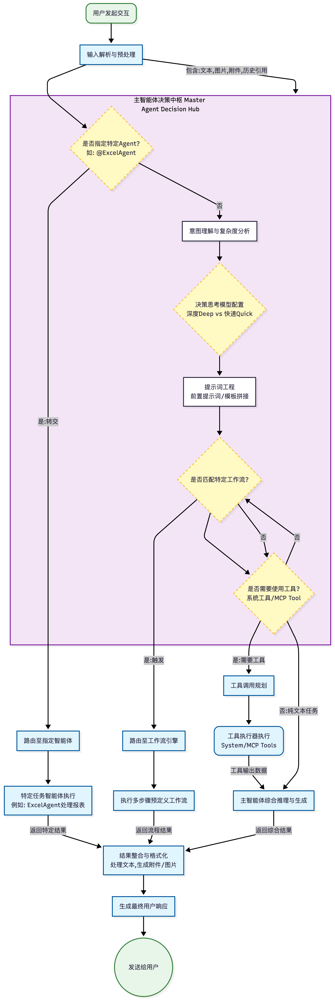
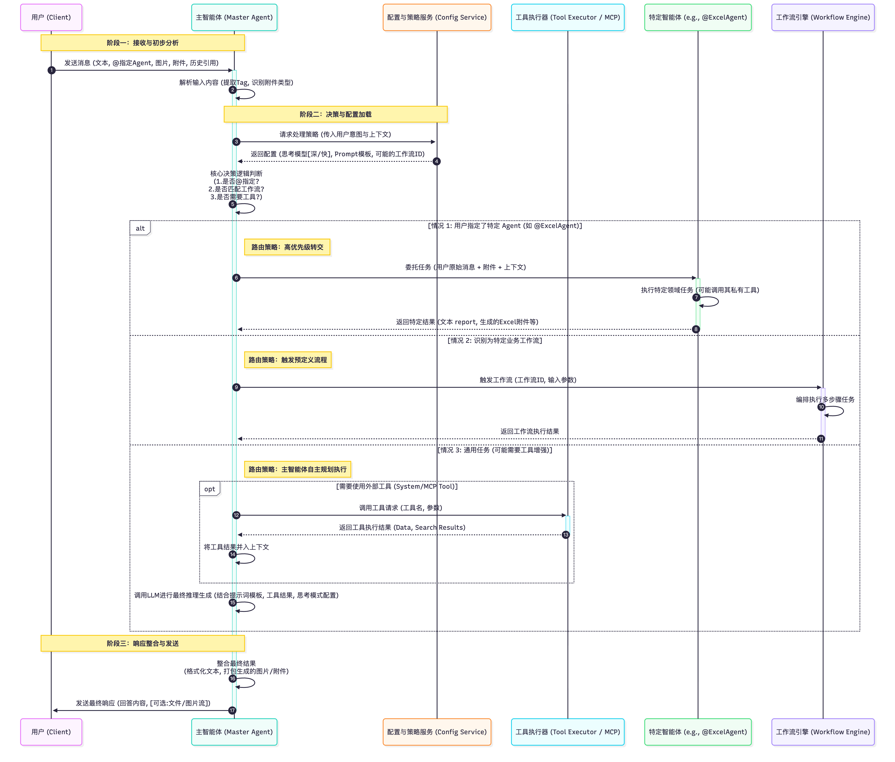
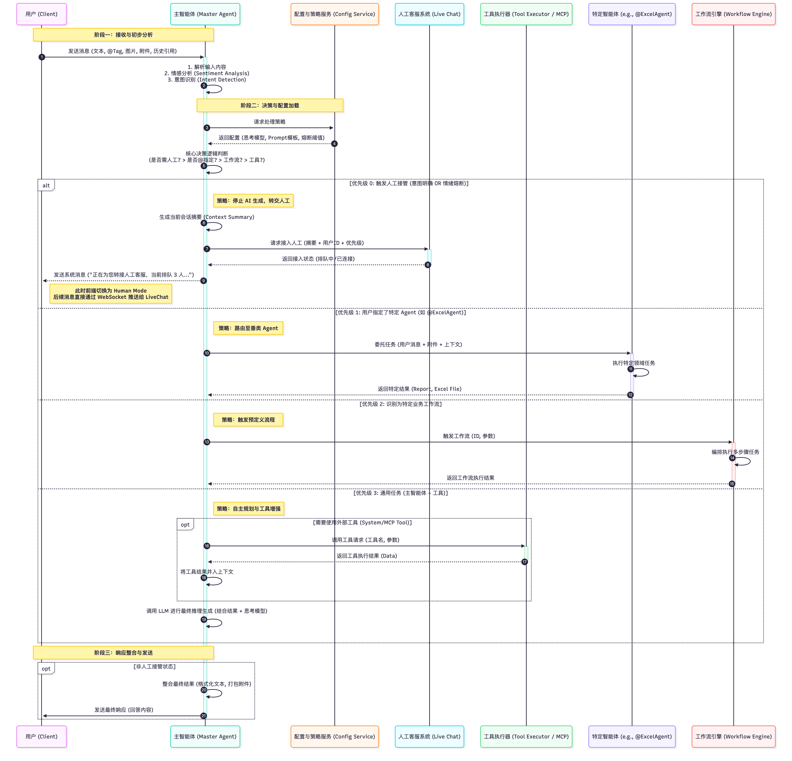
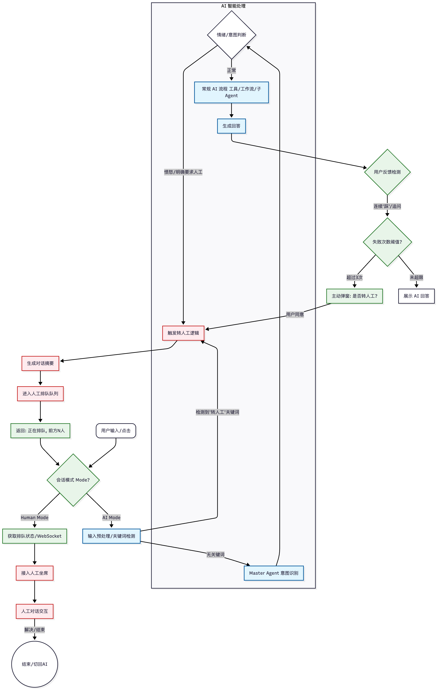

<!--
 * @Author: chengjiang
 * @Date: 2025-11-28 18:14:29
 * @Description: 待办事项
-->

# 大概设计：
面向群体：
1. 个人用户。
   1. 开发一套客户端使用。
2. 企业用户。
    1. 提供一套管理端。配置企业信息。
       1. 支持私有化部署。
       2. saas订阅。
    2. 提供插件。快速接入现有系统。作为ai与智能客服的载体。
       1. 包含完整的客户端管理。
       2. ui定制：在管理端可视化配置实现。（解决插件ui不通用问题。）

# 客户端：
> 目前ui部分基本完成。待加入：长期记忆功能（RAG对接）
> 需要接入的api功能：

## 登录注册：
1. 手机号/账户密码登录注册。
2. 短信验证码登录注册。
3. 二维码扫码登录（支持方式：移动端h5支持扫码功能方便pc端快捷登录, 微信扫码）。
4. 第三方登录api支持。

## 聊天页：
> 特别的：客户端的三种模式以下功能相同，但具体实现逻辑可能不同。
>   1. backend : 纯前端模式：无需登录，只需要接入模型key即可，记录存到本地。
>   2. frontend : 后台模式： 需要登录，接入配套的后台管理。（这里可考虑与宿主完成单点登录配置）
>   3. demo : 样例模式：里面包含各种demo例子。全部使用mock数据。

1. 发送消息接口对接（SSE）。对话需要增加记忆功能，一段对话长度的限制配置。
   1. 支持联网搜索（开关，agent是否支持查询网络，并返回引用网站）。
   2. 发送消息支持引用图片，文件，引用上文指定的生成消息。
2. 语音转文字接口对接。
3. 快捷回复列表：（需要agent参与查询历史用户问题统计出最常问的问题。）考虑放入缓存，减少token消耗。
4. 截屏功能优化：插件截屏ui缺失。
5. 推荐知识库功能：私有，支持引入外部知识库(如：金融领域，法律领域)，无需占用本地存储。
6. 历史记录的支持。
7. 语音总结功能，根据语音监控，生成可视化map，与文档归档。
   1. 会议总结。
   2. 语音聊天总结。
8. 收藏列表。记录有价值的对话。
9. 主题切换完善（支持化存储，ui主题切换）。
10. 设置功能：
    1.  记忆配置：是否开启记忆功能。（让ai生成专属的长期记忆（备忘录功能））
    2.  用户反馈。
    3.  用户信息编辑。
11. 输入框快捷信息选择：（支持时间范围，智能体艾特，知识库艾特）

# 管理端：
1. 聊天记录。
2. 埋点记录。
3. 工作流。拖拽设计。（参考dify工作流设计），既定的工作流，让agentq根据工作流执行。
4. 提示词。（需要增加模板，类似火山引擎的提示词模板做法。）
5. 智能体。
   1. 配置智能体工作流。
   2. 配置智能体提示词。
6. RAG 对接。
7. 重点：客户端ui可视化定制。（根据不同角色或者特定用户绑定一套完整客户端UI）
8. 重点：mcp对接
   1. 支持宿主系统的api快捷导入生成专属mcp-tool。
   2. 引入第三方mcp服务。
9. 重点：日志监控：引入agent分析。

# 后端：
1. OSS 对接。
2. redis 对接。
3. mcp对接：支持热重启。脱离管理端，单独部署。
4. 系统工具支持。

# 输入-生成消息流程：
## 流程图：

 
## 时序图：
 
 
## 支持转人工：
 
 